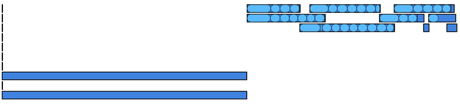

# What is bunny-logs ?

It's a simple log file analysis, with support for Dataflow.

You give it logs, and it will give you reports like this one:

    Summary for Job ID 123456789
    GrowCarrot : 
         0h00m10s (span),     0h00m40s (total),      4 #,   10.0 s each
    Harvest : 
         0h00m05s (span),     0h00m50s (total),      10 #,  5 s each
    FeedRabbit : 
         0h01m00s (span),     0h01m00s (total),      1 #,   60.0 s each
    OVERALL: 
         0h01m15s (span),     0h02m30s (total),      15 #,  10.0 s each

Each operation can be running on multiple computers or cores.
The "#" column indicates, for each operation, how many instances were run. 
Span is the time from the first instance starting to the last one finishing. 
Total is the sum of how long each instance lasted.
The final column is the average duration of each instance.

And pretty pictures like this one:

Each operation is a box, sub-operations are ovals inside the rectangle. 
Time goes to the right: operations running at the same time are on top of each other. Wider rectangles represent
longer-running operations. 

You'll get results even if you don't do anything special (the tool understands Dataflow logs), 
but you can get even better results if you add information to your log.

# Getting the results

Run analyzer.Main with your log as argument. It'll print the report to the screen and save the graph to a file.

# Adding to your logs

The easiest way is to replace calls to `new DoFn` with calls to `new DoFnWLog`. This will track when the bundles
start and end. 

You can see examples in the [src/main/java/com/google/bunnylog/examples/](https://github.com/googlegenomics/bunny-logs/tree/master/src/main/java/com/google/bunnylog/examples/) folder.

You can also change your code to print bunny-formatted log lines to indicate when things start and stop.

